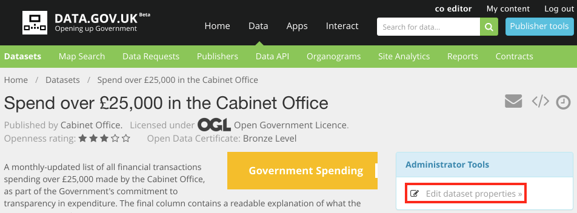
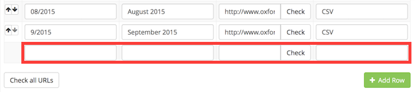

Central and local government bodies (including NHS) are required to publish the details of their expenditure transactions every month. This document provides links to the official guidance and details of how to add it to data.gov.uk.

## Which bodies are required to do this?

### Central government

> This guidance applies to all bodies within central government as classified by the Office for National Statistics, including departments, non-ministerial departments, agencies, NDPBs, Trading Funds and NHS bodies

(from [HMT Guidance](https://www.gov.uk/government/publications/guidance-for-publishing-spend-over-25000))

The ONS classifications can be found the "index" tab: [Public Sector Classification Guide, September 2015 (Excel)](http://www.ons.gov.uk/ons/rel/na-classification/national-accounts-sector-classification/classification-update-and-forward-workplan--september-2015/rft-table-1.xls)

and includes for example:

  * Clinical Commissioning Groups (CCGs)
  * NHS Trusts (England)
  * NHS Foundation Trusts (England)
  * Strategic Health Authorities (England)
  * Research Councils

### Local government

Local authorities in England, which includes for example:

  * county and district councils
  * parish council which has gross annual income or expenditure exceeding £200,000
  * London boroughs
  * transport authorities
  * fire and rescue authorities
  * waste disposal authorities

The full definition is in the [LGTC 2015](https://www.gov.uk/government/publications/local-government-transparency-code-2015).

## Timing

### Central government

> Spend is to be published one month in arrears, ie by the last working day of the month following the month to which the data relates.

(from [HMT Guidance](https://www.gov.uk/government/publications/guidance-for-publishing-spend-over-25000))

### Local government

> Must: Quarterly publication

> Recommended: Publish information on a monthly instead of quarterly basis, or ideally, as soon as it becomes available

> published not later than one month after the quarter to which the data and information is applicable

(from [LGTC 2015](https://www.gov.uk/government/publications/local-government-transparency-code-2015))

## What file format should the data files be?

> The files are to be uploaded in CSV file format. Microsoft Excel files should be converted to CSV.

(from [HMT Guidance](https://www.gov.uk/government/publications/guidance-for-publishing-spend-over-25000))

i.e. not XLS, ODS, PDF etc. Consistency is important for analysis across publishers.

Some bodies choose to provide a PDF in addition to the CSV, however if the process is manual then it is perhaps best to focus on just the CSVs.

## What columns are required?

NB: the first row of the file MUST be the column headings (no title or blank rows) and subsequent rows must all be transactions (no 'total' or blank rows).

Do not use different names for the columns. e.g. do not use "Amount (£)" - it must be "Amount".

### Central government spend over £25k

> The CSV file must have precisely one header line with field names exactly as in the example file supplied.

(from [HMT Guidance](https://www.gov.uk/government/publications/guidance-for-publishing-spend-over-25000))

Mandatory fields: Department family, Entity, Date, Expense type, Expense area, Supplier, Transaction number, Amount, Description

Optional fields: Supplier postcode, Supplier type, Contract number, Project code, Expenditure type

### Central government GPC spend over £500

> include transaction date, transaction reference, merchant name and the amount spent

(from [Government Procurement guidance](https://www.gov.uk/government/uploads/system/uploads/attachment_data/file/219671/pan-gp-card-policy.pdf))

data.gov.uk is not aware of any specific guidance on column names.

### Local government

LGA recommends a schema that is suitable for both spend transactions over £500 and GPC transactions. The data can be published as a single file or separate files.

Mandatory fields: OrganisationalUnit, BeneficiaryName, PaymentDate, Amount, IrrecoverableVATAmount, Purpose

These and many other recommended and optional fields detailed in: [LGA Spend Schema](https://github.com/esd-org-uk/schemas/blob/master/Spend/Spend.json).

Full details are in the [LGA LGTC 2015 guidance for "Publishing spending and procurement information"](http://www.local.gov.uk/documents/10180/11655/Transparency+guidance+2014+-+spending+and+procurement++20150601+v1.3.pdf/465594a4-779d-4063-b593-70a84f3bf253)

## What transactions should be included / excluded?

Include most things apart from payments to staff.

See the full lists:

 * [HMT Guidance PDF](https://www.gov.uk/government/publications/guidance-for-publishing-spend-over-25000) section 4.3
 * [LGTC 2015](https://www.gov.uk/government/publications/local-government-transparency-code-2015) section "Exclusions and exemptions"

## Can it just be on our own website or must it be on data.gov.uk as well?

> All data must be published and listed on the data.gov.uk index. The metadata descriptions will need to be maintained for all of the published data. Each entity is responsible for ensuring that their data is included on the data.gov.uk website.

(from [HMT Guidance](https://www.gov.uk/government/publications/guidance-for-publishing-spend-over-25000))

## How do I put this onto data.gov.uk?

NB: each publisher should only have ONE 'dataset' for 25k spend data and another one for GPC spend data. Don't add a new one every month - see [Monthly datasets problem](monthly_datasets_problem.html)

Most publishers should use the data.gov.uk web form to add each month's data:

1. Find your publisher on the [publisher page](https://data.gov.uk/publisher) and click on it.
2. Now on your publisher's page, if you don't see the '25k spend', '£500 spend' or 'GPC spend' dataset straight away, in the search box type "spend" or "expenditure" to find it. If it doesn't already exist then you'll need to [create it](dataset_form.html) and ensure that on the 'Data Files' tab you select "A timeseries record".
3. Click on the dataset.
   
4. If you don't see the blue box with "Edit Dataset properties" then either you need to log in, or if you are already logged in then you need to [become 'editor' or 'admin' for your publisher](becoming_an_editor_or_admin.html).
5. Click "Edit Dataset properties"
6. Click on the "Data Files" tab.
7. At the bottom of the table, add the new month's details.
   
   * Date: ignore the calendar that pops up that asks for a specific day in the month - just type the month and year in the exact `MM/YYYY` format e.g. `08/2015` for August 2015.
   * File Title: it's not necessary to repeat the date, but there needs to be something - you could just put `Spend transaction`.
   * URL: Paste into this box the CSV file download link. Ensure the link is the one that actually downloads the dataset immediately, rather than a link to a web page. (We suggest you ignore the check button as it is unreliable at detecting if the link is correct, and may fill in the format field inaccurately.)
   * Format: This should be `CSV` to match the file format.
8. Click 'Save and finish'.

Alternatively, if your organization happens to have its own data website (e.g. running CKAN) that is harvested into data.gov.uk, then you can do a similar process to add the dataset to that site instead, and when it harvests it will automatically be added to data.gov.uk as well. This is an excellent way to keep your site and data.gov.uk in step.

## At data.gov.uk can I just provide one link to a web page, which in turn provides the links to all the files?

This is bad practice, because it requires a human to find the actual download link - a computer cannot find it automatically - which is particularly import for aggregating large quantities of spend data for analysis. And even for a human, it is 'yet another barrier' to getting the data.

## How far back must the data be published?

### Central government

> * new items of central government spending over £25,000 to be published online from November 2010
> * new items of local government spending over £500 to be published on a council-by-council basis from January 2011

from [Prime Minister's letter on transparency May 2010](https://www.gov.uk/government/news/letter-to-government-departments-on-opening-up-data)

> * government procurement card spend data for transactions above £500 in value ... from end September 2011

from [Prime Minister's letter on transparency July 2011](https://www.gov.uk/government/news/letter-to-cabinet-ministers-on-transparency-and-open-data)

It is important to supply data back to 2010/2011 to allow comparison over several years.

### Local government

> Under the Local Government Transparency Code 2014, local authorities were required to publish this data on the first occasion, not later than 31 December 2014 and quarterly thereafter.

(from [LGTC 2015](https://www.gov.uk/government/publications/local-government-transparency-code-2015))
