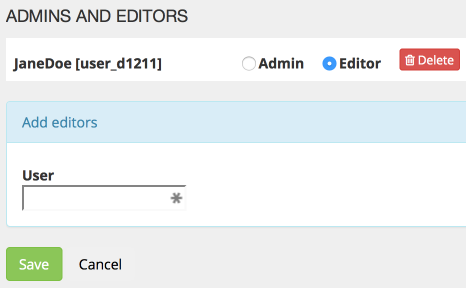
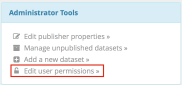
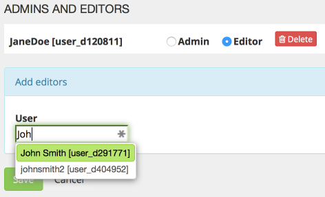
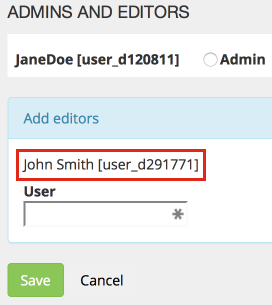
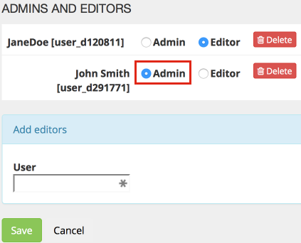
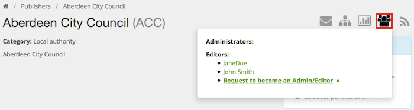
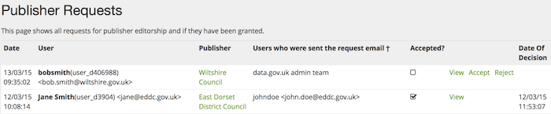

## Introduction

This is an admin guide for making a user an Editor or Admin, which will allow them to add datasets to data.gov.uk (and related tasks). It is the role of the publisher's Admin (or failing that the data.gov.uk sysadmin) to respond to requests from users to become Editors/Admins, or to assign them proactively.

A related guide [Becoming an Editor or Admin](becoming_an_editor_or_admin.html) explains the Editor and Admin roles, as well as how to become one, from the requesting user's perspective.

## Emailed requests

To become an editor, [users should be using the publisher's 'Request to become an editor' link](becoming_an_editor_or_admin.html#become-an-editor):

This results in a 'request' email being sent to the admins for the publisher. If that publisher has no admins then it will be sent to admins for the parent publisher's admins, and so on, until it falls back to data.gov.uk's central contact point.

Clearly anyone can make the request, and it is important to filter out invalid ones. The email address of the requester is displayed, and data.gov.uk requires all email addresses to have been validated. You should check that the email address corresponds with the publisher (organization) requested. And the message should say what the user's responsibility is. If there is any doubt over the authenticity or authorization of this request, then further checks should be made.

Assuming it is a bone fide request, the admin/sysadmin should note the user name and then use the link to the Edit User Permissions page to make them an Editor or Admin, using the instructions below.

NB there is no automatic response sent to the requesting user, so it is essential that the admin/sysadmin emails them back to give the outcome of the request.

## Edit User Permissions page

This page is for admins/sysadmins to manage who is an editor or admin for a particular publisher. It is linked from the request email, and also from the publisher page:

### Assign an Editor

You can assign a user as an Editor as follows:

1. Typing in their user name in the input box in the blue 'Add editors' box. As you type, candidate users will appear in a drop-down list (with their internal ID e.g. `[user_d12345]`, which you can ignore). If a particular user does not appear, then check you have the user name correct - it is not the same as their 'name' or 'email address'. Also they need to have validated their email address by clicking on the link in the email they got sent on registration. (Occasionally we have a problem where the username is not listed for a new user until they have logged in and accessed the Data Search page of data.gov.uk.)

   

2. Selecting the correct user from the drop-down list, either by clicking, or using the cursor keys followed by Enter. This will add the username to a list. This allows you to add several people at once.

   

3. Click 'Save' to save all the changes on the page.

The user is now an Editor and they will see the blue "Publisher tools" button when logged in. Email them to let them know.

## Assign to Admin

If you want to upgrade an Editor to an Admin, then:

1. Go back into the Edit User Permissions page for the publisher:

   

2. And you can click on the 'Admin' radio button for the user:

   

3. Click 'Save' to save all the changes on the page.

## View Editors and Admins

An Admin or Sysadmin can view the users who are Editors and Admins by navigating to the publisher page and using the 'People' icon:

## Management of requests

There is a management view of all Editor/Admin requests that are made, available for Sysadmins only at <http://data.gov.uk/publisher/users/requests>. This shows all details of requests and allows making decisions on outstanding ones. NB remember to email the users to let them know of decisions.

