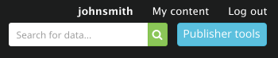

# Administrator and editor accounts

You must have an 'administrator' or 'editor' account if you want to publish on data.gov.uk.

If you have an administrator account, for your organisation you’ll be in charge of:

* appointing other users as editors and other administrators
* updating details about your organisation on data.gov.uk
* creating and editing data records on data.gov.uk

If you’re an editor, you’ll be responsible for:

* creating and editing data records on data.gov.uk

You need to ask for an administrator or editor account. There’s no limit on how many administrators or editors your organisation can have.

### Administrator

The administrator (admin) account serves to manage all editors creating/editing metadata under a given parent department. Administrators can create editors within their publisher hierarchy or across the family of publishers.

Administrators are:

* The people that will approve your editor rights request
* First point of contact for FOI request (unless otherwise specified by the publisher)
* Create editors and other administrators
* Moderators of the activity of editors across its hierarchy
* Can edit the details about their publisher (title, description, category etc)

### Editor

Editors are the people in charge of creating metadata records for their organisations in Data.gov.uk. They have the ability to create and edit metadata for their assigned organisation. Editors are also responsible for regularly checking the comments on their datasets to capture ideas, clarify questions users of the data may have or discover, via feedback on the page, issues with the quality of the data. Editors:

* Create and edit metadata records (or configure their harvesting) for their organisation
* Take implied responsibility for keeping up to date with questions and issues with their records raised in the comments section of the metadata record page

## Getting an account

1. Go to <http://data.gov.uk/user/register>

2. Complete the user registration form and click "Create new account"

An email should arrive in your in-box within 30 minutes (check your spam folder).

3. Click the validation link in the email to validate email address, which activates your account.

Note: if you do not validate your email address within 5 days then your account will be deleted. In this case, simply create another account.

You will now need to become an editor

# Become an Editor

1. Go to https://data.gov.uk/publisher

2. Search the name of the publisher for which you need editor/admin permissions and go to its main page by clicking it. NB If the publisher is not listed, please use the Contact link at the bottom of the web page and request it is added.

3. Click on the administrators icon on the icon bar towards the top right of the page. Select ‘request to become an editor’.

   Occasionally users cannot see the icon bar, due to network security. If this is the case, in your browser address bar, manually insert into the URL "apply/" before the publish name. e.g. `https://data.gov.uk/publisher/cabinet-office` becomes `https://data.gov.uk/publisher/apply/cabinet-office`. Now press Enter/Return to load the next page.

4. Fill out the form stating your position that gives you the authority to publish data on behalf of the organization.

5. Take note of which department or organization the request was emailed to.

You should be emailed by this organization when you have been made an editor. If you don't hear back for a couple of days, contact the data.gov.uk team using the Contact link at the bottom of the web page.

Once you are an editor or admin you will see the blue "Publisher tools" button when logged in, and can now [publish data](publishing_on_data_gov_uk_overview.html).

# Become an Admin

Follow the same [instructions as for editor](#become-an-editor) but be sure to mention in your request that you would like be the Admin and take responsibility for approving other users for your publisher (and any sub publishers).
