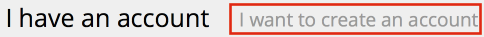
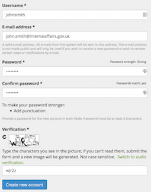
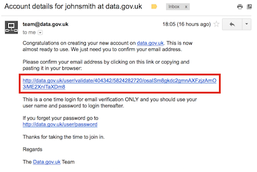
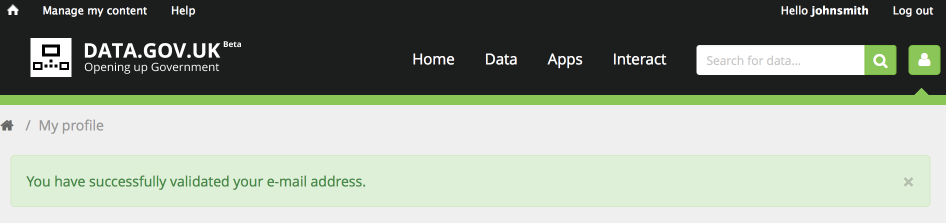
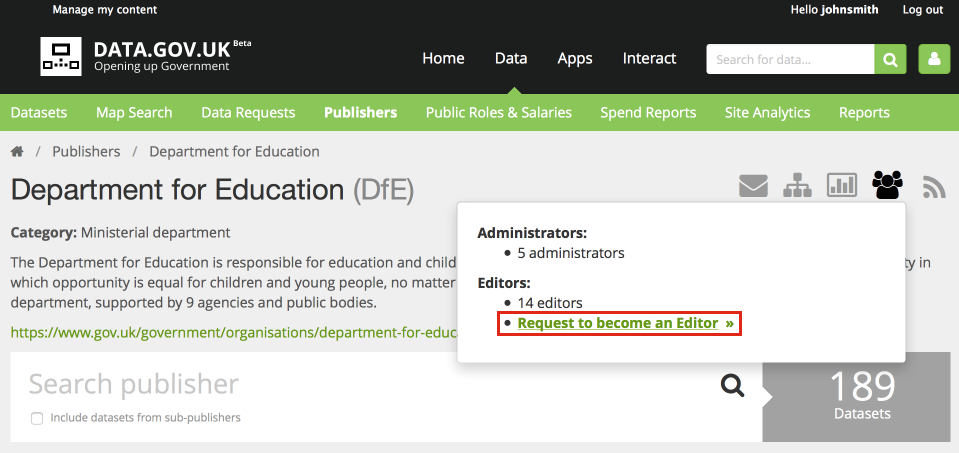
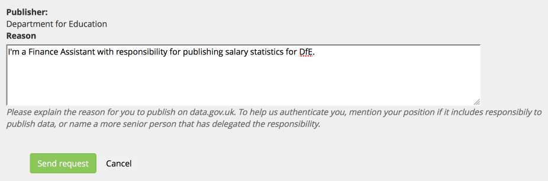
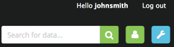

## Account types

### Admin

The administrator account serves to manage all editors creating/editing metadata under a given parent department. Administrators can create editors within their publisher hierarchy or across the family of publishers.

Administrators are:

* The people that will approve your editor rights request
* First point of contact for FOI request (unless otherwise specified by the publisher)
* Create editors and other administrators
* Moderators of the activity of editors across its hierarchy
* Can edit the details about their publisher (title, description, category etc)

### Editor

Editors are the people in charge of creating metadata records for their organisations in Data.gov.uk. They have the ability to create and edit metadata for their assigned organisation. Editors are also responsible for regularly checking the comments on their datasets to capture ideas, clarify questions users of the data may have or discover, via feedback on the page, issues with the quality of the data. Editors:

* Create and edit metadata records (or configure their harvesting) for their organisation
* Take implied responsibility for keeping up to date with questions and issues with their records raised in the comments section of the metadata record page

## Getting an account

1. At <http://data.gov.uk/>, click on the user icon at the top right of the screen: 

2. Choose the 'I want to create an account' tab 

3. Complete the user registration form

Click "Create new account"

The email should arrive in your in-box within 30 minutes (check your spam folder).

4. Click the validation link in the email to validate email address, which activates your account.

You can tell that you are logged in by the message "Hello (username)", next to the "Log out" link.

This account is currently the same as any member of the public - it can create comments, submit apps, make data requests etc. But it is not an editor or admin yet. You can tell this visually because there is no blue spanner icon next to the user icon.

# Become an Editor

1. Log in and click on 'Data' in data.gov.uk's menu and then click 'Publishers' from the submenu.

2. Search the name of the publisher for which you need editor/admin permissions and go to its main page by clicking it. NB If the publisher is not listed, please use the Contact link at the bottom of the web page and request it is added.

3. Click on the administrators icon on the icon bar on the top right of the page. Select ‘request to become an editor’.

4. Fill out the form stating your position that gives you the authority to publish data on behalf of the organization.

5. Take note of which department or organization the request was emailed to. 

You should be emailed by this organization when you have been made an editor. If you don't hear back for a couple of days, contact the data.gov.uk team using the Contact link at the bottom of the web page.

Once you are an editor or admin you will see the blue spanner icon when logged in, and can now [publish data](publishing_on_data_gov_uk_overview.html).

