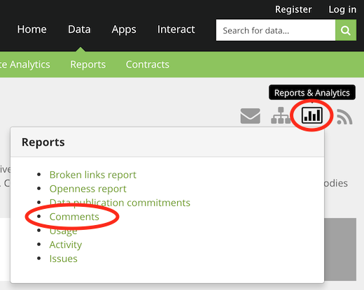
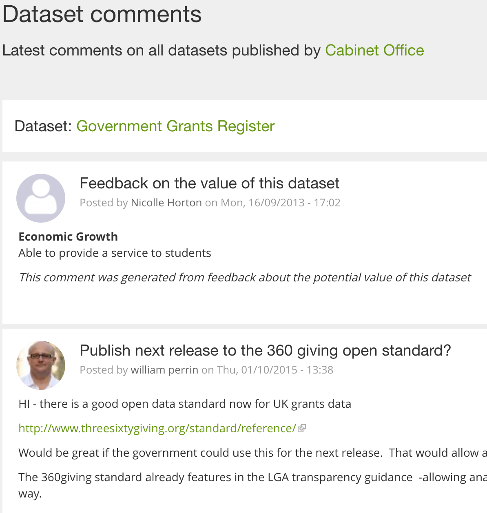
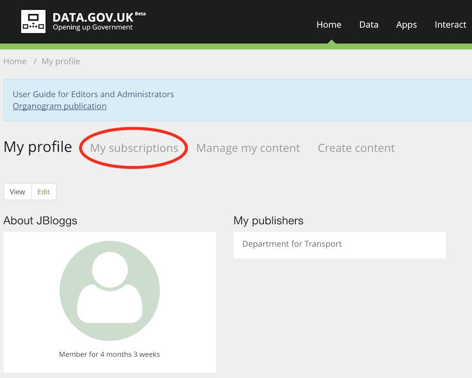
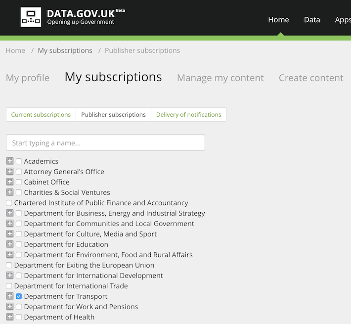
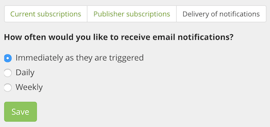
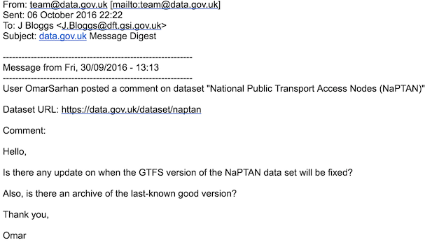

## Introduction

data.gov.uk gives users the ability to add comments to datasets, apps, forums and data requests. This allows users to note uses of the data, share tips, point out issues and ask for help. Responses often come from other users, and publishers themselves should respond and make use of the feedback.

## Viewing dataset comments

Of course you can view comments on each dataset page individually, but you can also view all the dataset comments for a particular publisher in one go:

1. On the [publisher page](https://data.gov.uk/publisher) select the publisher (organisation) whose comments you wish to view.

2. Now on the specific publisher's page (e.g. [Cabinet Office](https://data.gov.uk/publisher/cabinet-office)) select the graph icon ('Reports & Analytics') and then 'Comments':

   

   This page displays comments for all datasets for this publisher:

   

## Subscribing to publisher notification emails

You can also subscribe to receive emailed about dataset changes and comments:

1. [Log in](https://data.gov.uk/user/login)

2. Click 'My subscriptions'

   

3. Click 'Publisher subscriptions'

4. Tick the box next to the publisher you want to track.

   

5. Click 'Delivery of notifications' and choose the frequency of emails to receive.

   

   Now you will receive emails, such as:

   

   Note: This "publisher subscription" will not be listed under "Current subscriptions", which is only for subscription to individual datasets etc. So don't worry if it says "You are not subscribed to any content"