NB You can't use this method for publishing INSPIRE/Location data. See more [here](inspire.html).

# Add a dataset

1. Ensure you have a user account on data.gov.uk and it has been assigned permission for your organization, either as editor or admin. See: [Becoming an editor](becoming_an_editor_or_admin.html)

2. There are two methods:

   A. Click on the blue spanner icon and choose "Add a new dataset".
      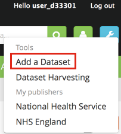

   B. Go to your publisher page and click "Add a new dataset".
      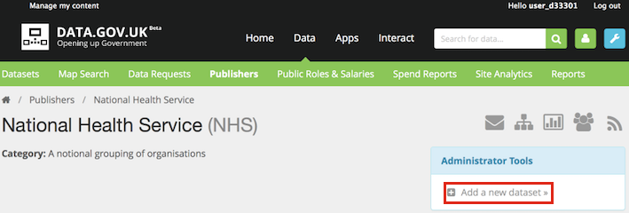

3. Complete the form using the guidance [below](#form-fields-guidance).

4. Click 'Save and finish'. There is more about this [below](#form-submission).

# Edit a dataset

1. Ensure you have a user account on data.gov.uk and it has been assigned permission for your organization, either as editor or admin. See: [Becoming an editor](becoming_an_editor_or_admin.html)

2. Find the dataset you wish to edit and click "Edit dataset properties"
   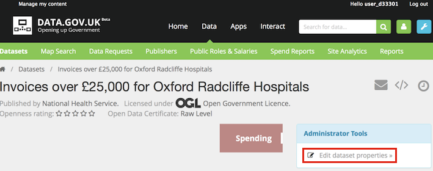

3. Complete the form using the guidance [below](#form-fields-guidance).

4. Click 'Save and finish'. There is more about this [below](#form-submission).

# Form fields guidance

### Add a dataset

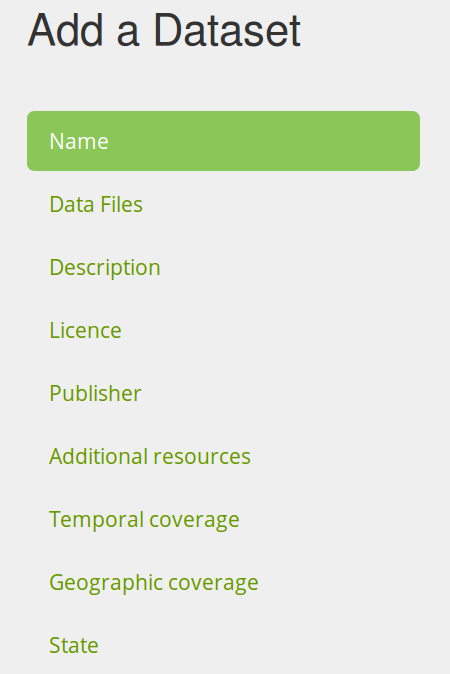

The publication/editing wizard follows a tab structure. When creating new datasets you will have to click on next at the bottom of the wizard to continue.

### Naming the dataset

The dataset name is the first thing seen when this record appears in the search results, so it's important to get right.

* It's got to be understandable by a layman - explain jargon e.g. "AfA458 LIDAR Composite DSM - 1m" might be better as "LIDAR surface map - composite DSM 1m" (and the latter bits only because there are several LIDAR maps to differentiate from)
* Give the context e.g. "Price Paid Data" would be better as "Land/Property Transaction Prices Paid"
* Don't include the name of the publishing organization (since it is already shown in the search results under the name) so if Brent Council is publishing its car parks, rather than "Brent Council Car Parks" call it "Car Parks".
* Don't feel it is necessary to make it the same as the official title of the data if it breaks the guidance here. If the official title is short, you could include it in the name with something more descriptive, or if it is longer, simply include the official title in the description field. e.g. "Boundary-Line" would be better as "Boundary-Line - electoral & administrative boundaries".
* Don't include a date. Usually data is updated with new Data files, so instead put the date in the Data file date field (change it to "time series"). e.g. "Spend transactions 2012" would be better as "Spending transactions"
* Check the spelling, since the URL is based on the name and cannot be changed after you save the form.

### URL

When you create a dataset, a URL for your dataset will be created from the name that you enter. 

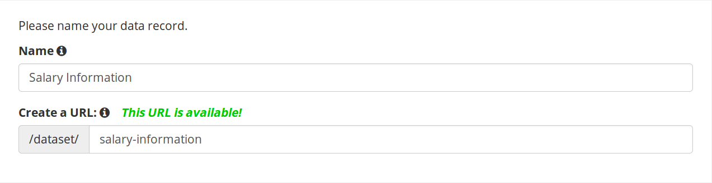

If the generated URL is already used by another dataset then a warning will be displayed saying 'This URL is not available'. You can change either the name of the dataset to generate a new URL or manually change the URL until a unused value is found. Including the name of your organisation in the title is an easy way to make it unique.

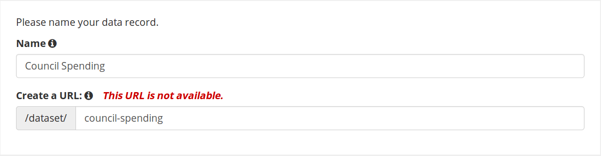

When you edit a dataset, the URL will not be editable. This is to provide continuity for people when they refer to the dataset. This is particularly important to users of the API.

### Information icons

Many fields have an 'information' icon, which displays more guidance if you hover the mouse over it.

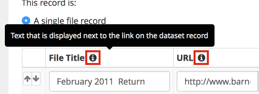

### Timeseries vs Single File

It is very important that you select the right type of dataset. If you are publishing a dataset that will have updates across time (yearly, monthly, etc.) then make sure you select the timeseries option on the data files section. This will allow the date of the file to dictate the sorting, so the latest file is automatically presented on top and everything else falls in chronological order.

If you choose single file and then add subsequent publications, you will have to order them manually. *You should not select single file for datasets that will have new files across time*.

[Monthly datasets problem](monthly_datasets_problem.html)

### Data files

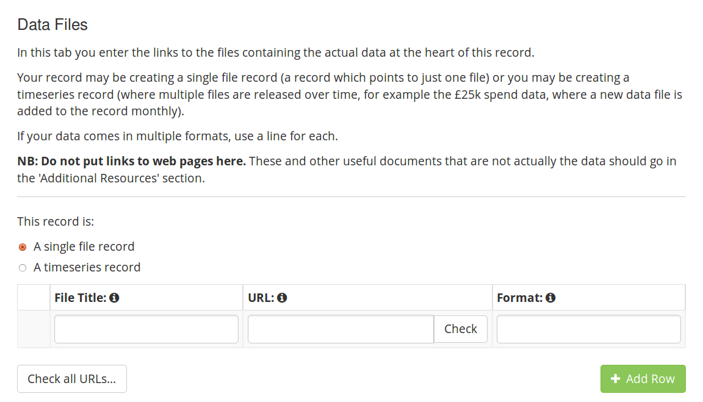

* Choose whether you are creating a single file record (a record for a one-off file) or a time series.
* If it is a time series you need to give it a date (5). You can specify just the year (YYYY) or just a month (MM/YYYY) or a full date (DD/MM/YYYY).
* Give the file a succinct title (2). e.g. "Spreadsheet with all tables". If it is split into regions say what this file is e.g. "North-East England". There is no need to repeat the date if it is a time series, but if the date needs explaining then do so, e.g. "Financial Year 2012/13".
* Provide the URL (also known as 'link') for the file (3). Do not link to an HTML page, but to the file download directly.
* You can then check if the address is correct by using the 'Check' button (4) or 'Check all URLs' after you have finished adding the links. However it can be unreliable - see the section on the Check button below.
You can add more files (some returns, even if they are single may contain more than one file) by clicking the plus sign (5).

Although it says "files" you should also add links to APIs here (e.g. SPARQL, WMS, etc). Usually that is the root URL of an API that might not return much by default, but it is still good to add it here. If you have a web page that helps you call SPARQL queries then a link to that would go in the Additional Resources section - see below.

### Time series

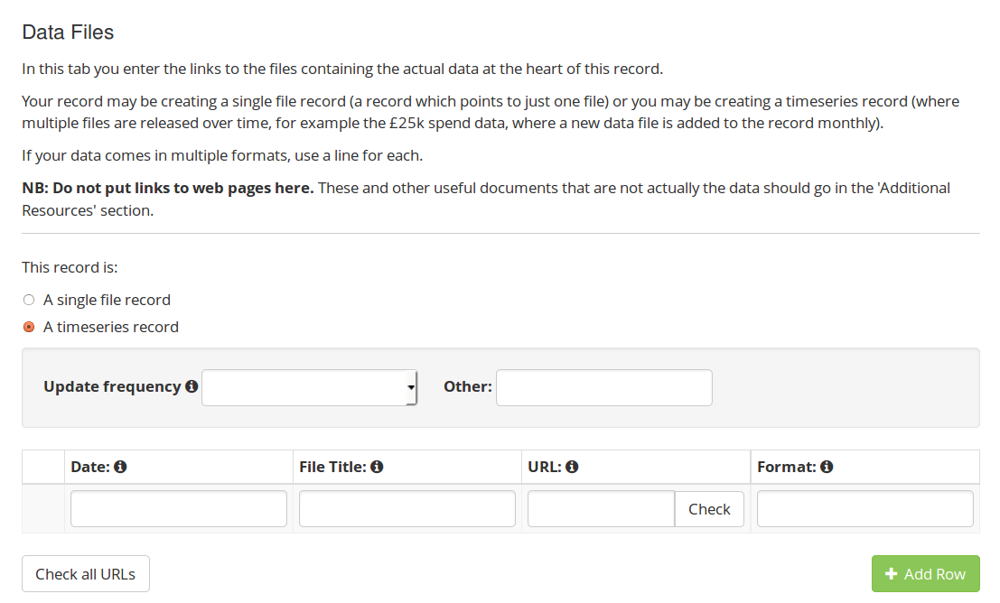

If you select time series then you can specify the "Update Frequency" and get the "Date" column to fill in for each file.

The benefit of choosing 'time series' is that the files will be displayed to the public ordered in date order, and previous years hidden by default. For more than a few files, this is a much better experience for users. In addition, the date is available to users in a machine-readable format.

### 'Check' button

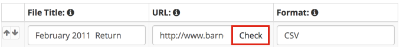

The 'check' functionality allows the system to identify the format of the file and automatically add it to the record, avoiding chances of different spellings. The 'check all URLs' option allows you to check that the URLs entered are all active and working.

If you encounter problems when clicking the 'check' or 'check all URLs' buttons (no format appears in the format box or the check all URLs process takes too long ) don't use them. Manually enter the format of your file (which SHOULD always be CSV or another open format, NOT XLS, HTML OR PDF). This issue arises because some older browsers may not work well with this feature, and the file type is determined simply by the URL extension or mimetype.

### Description and themes

Provide as much information about the dataset as you can, remember that the first few lines of this description will appear in search results

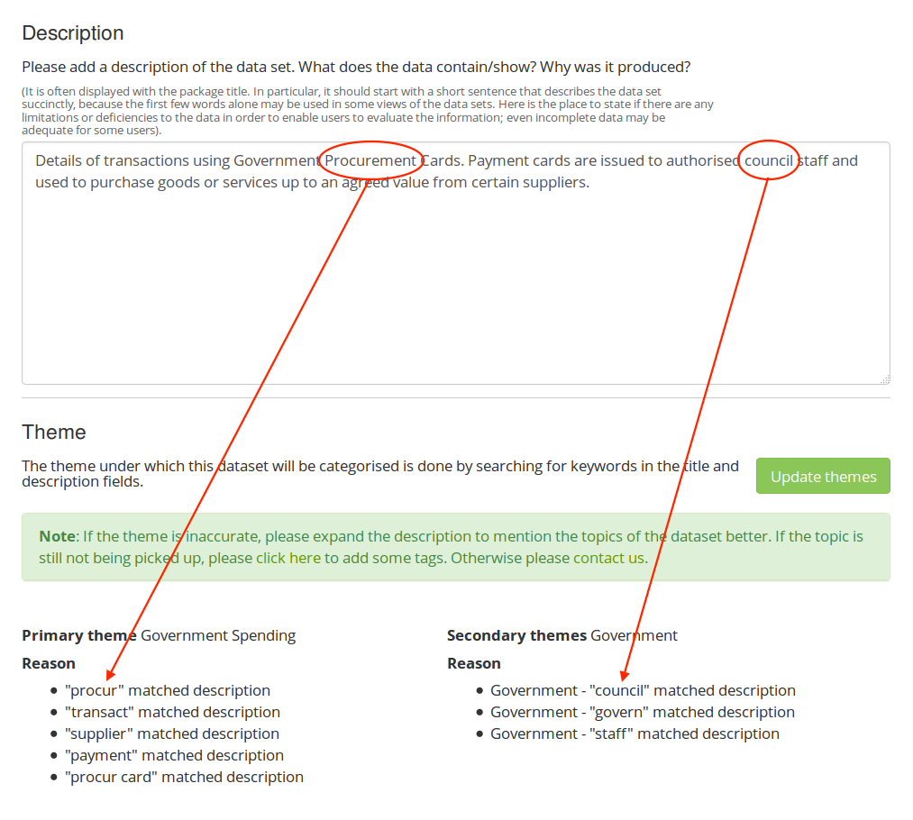

A primary and secondary themes are generated from the text entered in the description box. Click on the 'Update themes' link to generate them. The reasons why the themes were chosen will be listed. If you think that the themes are inaccurate, please expand the description to mention the topic of the dataset better. If that still isn't working then follow the instructions to add tags or [contact us](https://data.gov.uk/contact).

### Licence

Select the licence that the data is being released as. As the form states, this should be OGL for nearly all of central government and its agencies. Publishers should select OGL or other open licence in the list if at all possible. However if it is not possible then select "other" from the drop-down and type the licence details in the box which appears.

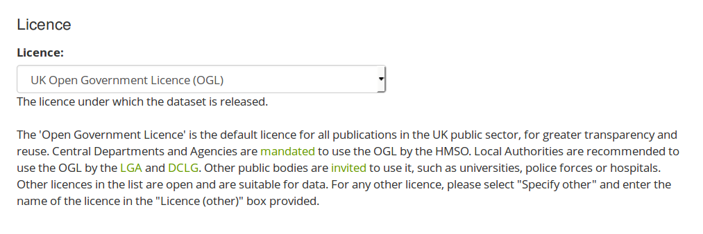

### Publisher

Select the organization that publishes this data. The only available options on this list are the publishers that you are an Editor or Admin for.

### Contact details

When you select the publisher in the drop down list, the contact details from our records associated with the publisher will be displayed. If these details are not suitable for this particular dataset, then you can edit them here and they are stored as an exception.

**Note: this feature is currently not working correctly. The contact details associated with the publisher will not be displayed in the form. However they will be displayed by default when you view the dataset, unless you provide different ones in this form.**

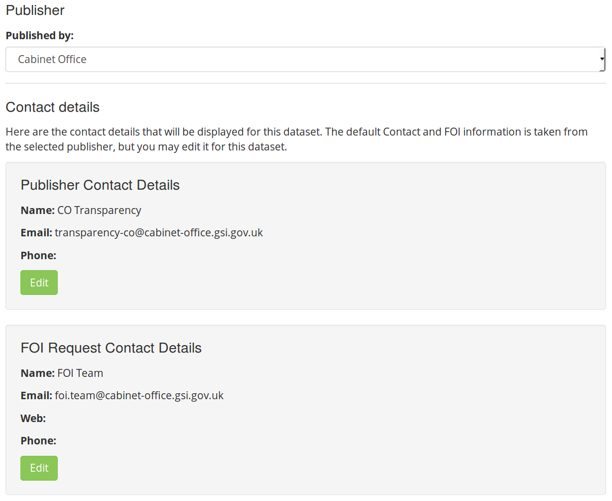

### Additional resources

Here you can enter links to any other document or web page that provides more information on the dataset.

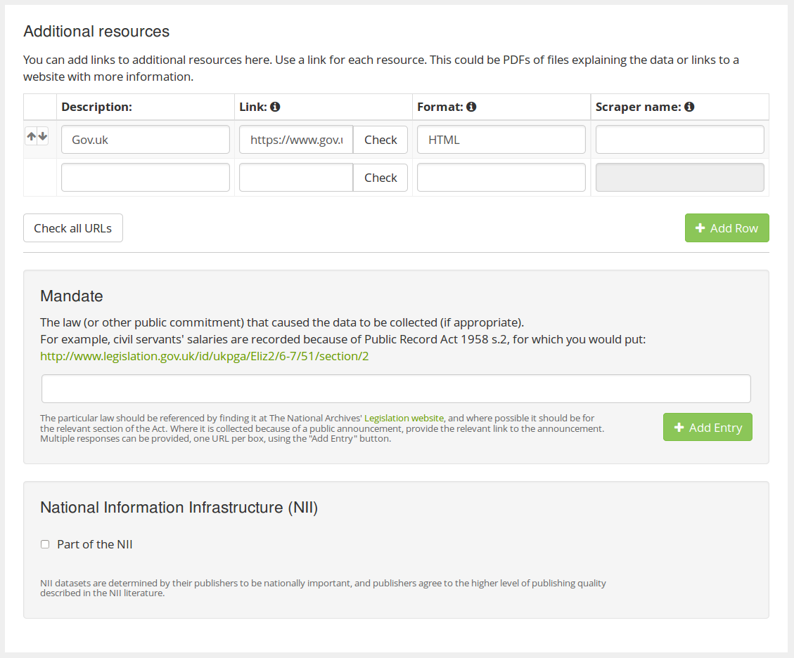

Please ignore the 'Scraper name' column and leave its contents blank.

### Temporal coverage

Where available it is important to include the time period for the data. This may be a single date or a range of dates. If a single date is being entered please leave the second box blank.

The dates should be in the format DD/MM/YYYY, e.g. 21/03/2007. Optionally the date can include the time in the format HH:MM, e.g. 07:45 31/03/2006.

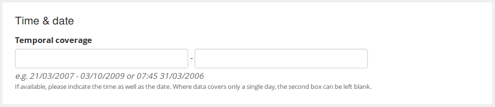

### Geographic coverage

It is also useful to include geographic coverage for the dataset. Use the checkboxes to select one or more areas which are covered by the data.

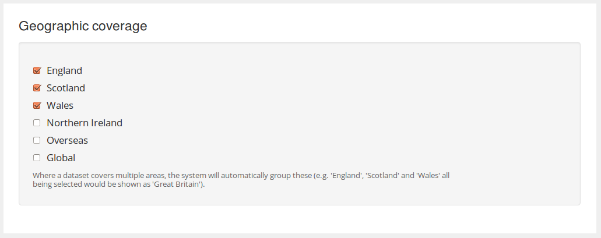

### Extras

Other odd pieces of information may be attached to a dataset, such as fields that used to be on the form but have since been deprecated. These are collected together in the 'Extras' tab. **However** editing this is reserved for sysadmins, so [contact us](https://data.gov.uk/contact) if it is important to change this information on an existing record.

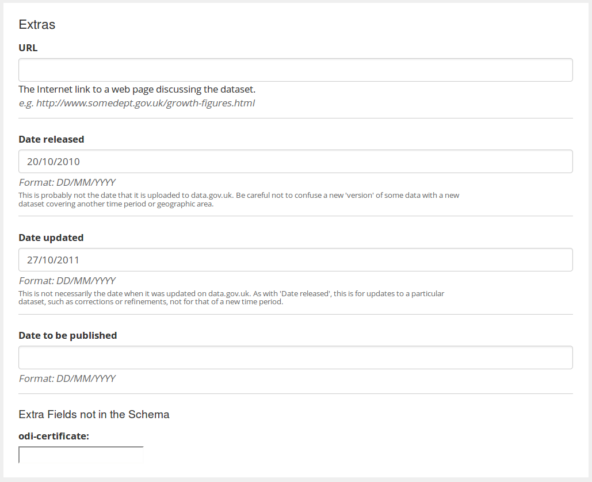

# Form submission

## Form errors

When you click "Save and Finish", if there are problems with any field then it will list them at the top, and also with yellow warning triangles on the appropriate tabs, and when you click on the tab red sharded boxes say what the problem is next to the appropriate field e.g.
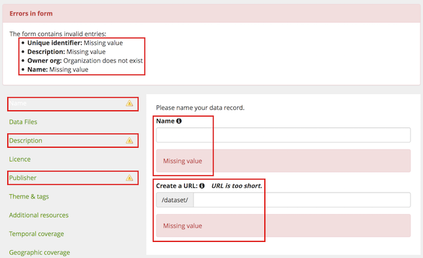

Occasionally new mandatory fields are added to the form. This can cause form errors to appear when you edit an existing dataset, even if you've not changed anything. In this case, fill in the new field to be able to save it successfully.

If, after clicking 'Save and finish’, you are still in the editing screen then: **YOUR CHANGES HAVE *NOT* BEEN SAVED!**

## Caching

The data.gov.uk site is cached for 1 hour for general users, but not if you are logged in. This means that if you add a dataset or make a change, you will see it has changed straight away, but it will take up to an hour before it becomes visible to another person visiting the site (i.e. someone who does not log in). Please be aware of this when notifying people or announcing releases.
