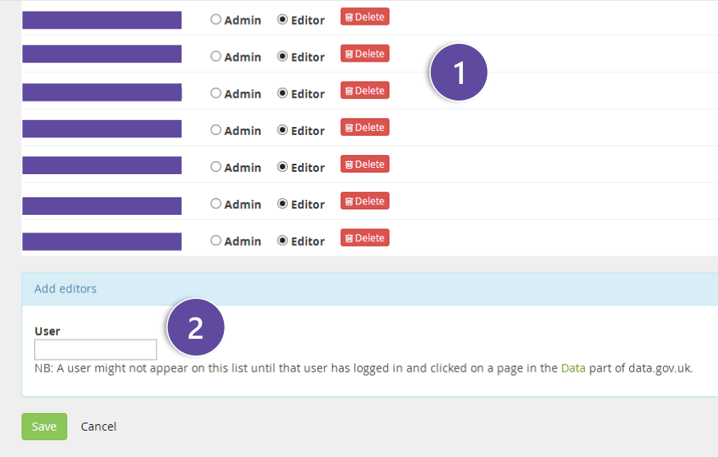

This page shows a list of users that have been given permission within the
publisher.

1. Here you can manage which users have what rights regarding your publishing entity

2. Here you can add new users, there is an autocomplete function, just start typing the username you wish to add and a list of suggested users will appear for you. Click on the user you wish to add and they will be added to a list above the input box.   Once you have added all of the users you wish click on the save button. When you come back to this screen the user(s) will be added to the main list and you can change their permissions
