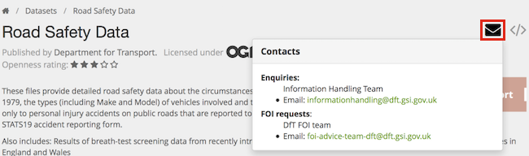

### Do you have data about X?

You're invited to search the data.gov.uk data catalogue.

Try the data.gov.uk [search page](http://data.gov.uk/data/search) or read more about [finding data](finding_data.html).

### You don't have the dataset I want

Missing data can be requested using the 'Data Requests' process.

First [search the existing requests](http://data.gov.uk/data-request) and if it is not there, [create a request yourself](http://data.gov.uk/node/add/dataset-request).

### Can you tell me more about dataset X?

If important information about the dataset is unclear or missing from the dataset page then there are a few ways to proceed:

1. Log-in and write a comment underneath the dataset. Other users might also have the same questions and others may well be able to answer them.

2. Contact the publisher of the data directly. To do this, the publisher should have filled in their contact details, which is visible by clicking on the dataset's 'envelope' icon.

3. Log-in and [create a Data Request](http://data.gov.uk/node/add/dataset-request) - describing in detail the information that is missing and the value of knowing it. The publisher of the data will be contacted and your request will be tracked.

### How do I contact the publisher of a dataset?

data.gov.uk holds contact details for many publishers and more specific ones for particular datasets. These are shown if you go to the page for the dataset in question and click the 'envelope' icon (circled in red):

In some circumstances we only provide a link to the What Do They Know page, which allows you to make an FOI request. This is only for publishers that have not provided data.gov.uk with better contact details.

If none of these help, try using an internet search engine to find a way to contact the publisher of the data.

### Can you provide me with data about X?

Firstly, see if the data is listed on data.gov.uk already - see [Do you have data about X](#do-you-have-data-about-x)?

If the data is not listed but you believe it is collected by a public sector body, then log-in and [create a Data Request](http://data.gov.uk/node/add/dataset-request) - describing in detail the data that should be released and the value to the public of it being published. The holder of the data will be contacted and your request will be tracked.

### Is personal information at risk on data.gov.uk?

The data published on data.gov.uk, and on related websites, will not identify or provide ways to identify individuals, unless that information is already published (like head teachers of schools) or [senior public-sector roles](organogram-data.html).

### How were the datasets on data.gov.uk selected?

Excluding personal and sensitive information, all information created by public sector bodies is, in principle, available for re-use. In the past, different approaches were adopted by local and regional authorities and individual agencies. Since data.gov.uk launched in 2010, the government has been widely encouraging all previously inaccessible public information to be made accessible through this website. For more details on what is being prioritised you should have a look at the [National Information Infrastructure](https://data.blog.gov.uk/2015/03/24/progress-on-the-national-information-infrastructure-project/) section.

Public sector bodies who are encouraged to publish on data.gov.uk include: central government, local government, agencies (NDPBs), arms-length bodies, NHS, police, academics, charities and bodies with any public function.

### How can I get in contact with the project?

Announcements are made on the the [data blog](https://data.blog.gov.uk/) and you can ask us questions on Twitter [@DataGovUk](https://twitter.com/DataGovUK). You can also send messages to our team via the [contact form](http://data.gov.uk/contact). To hear about keep up with the uses of data, check the [apps](https://data.gov.uk/apps).

### Where can developers discuss ideas, applications and vizualizations using the data?

Please use the comments section at the bottom of each dataset page. For more general discussion, we suggest you make comments on twitter with #opendata or address us with @DataGovUk.

### Can I use this data for commercial purposes?

It's down to the licence, which is displayed against every dataset. For the majority this is the Open Government Licence, which we're delighted to say allows commercial use. Check the licence text for the full terms.