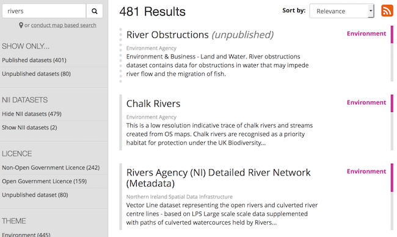
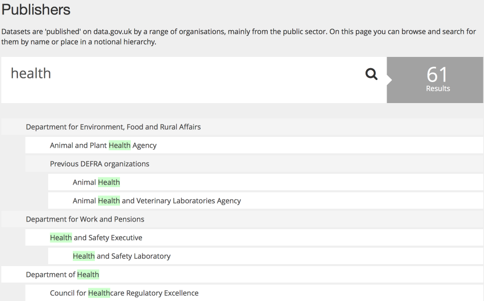
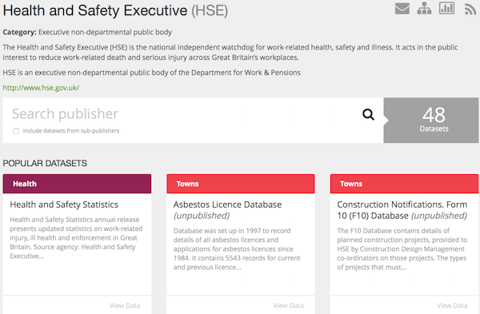
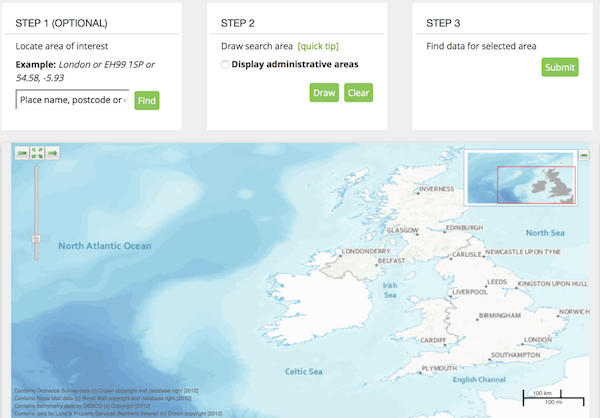
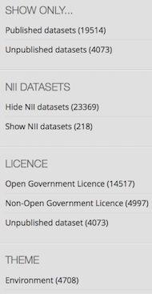

Whether you know exactly what data you want, or just want to browser, then data.gov.uk provides several tools to help.

## Search by keyword

On the [search page](http://data.gov.uk/data/search) you can click on the search box and type related words ('keywords'), like for a normal internet search engine.


When you press Enter or click on the magnifying glass icon, it will return the results.



You can change the order of the results using the 'Sort by' drop-down.


### Keyword search tips 

When using keyword search, you can use advanced operators to enhance your query.
The examples below show how you can use those operators.

* ```"armed forces" expenses``` - search for exact phrases by putting quote marks around them

* ```primary school -care age``` - exclude words or quoted phrases by using a minus sign or NOT

* ```primary OR secondary school``` - use 'OR' to allow alternatives (the default is to 'AND' all of the terms)

You can also search specific fields, ```publisher:cabinet-office res_format:CSV``` searches only for CSV files published by the Cabinet Office.

Some of the fields that are available to you are listed below:

* __name__ - name of the dataset, as seen in the dataset's URL.
* __title__ - The title of the dataset
* __notes__ - The description of the dataset
* __license_id__ - The licence, such as license_id:uk-ogl
* __publisher__ - Publisher names, as found in the publisher's URL, e.g. cabinet-office, or forestry-commission
* __parent_publishers__ - As for publisher, but shows the top-level publisher
* __res_format__ - The format of the resource, such as CSV, or XLS.
* __res_url__ - The URL of a resource.
* __UKLP__ - UKLP/INSPIRE records. This should be True or False.
* __core_dataset__ - If true, only datasets in the NII. If false, only datasets not in the NII.
* __metadata_created__ - When the dataset was created. This is a date format, see below.
* __metadata_modified__ - When the dataset was last modified. This is a date format, see below.

You can also invert the search by prepending ! to the key. For example, to find all CSV files that are not published by Cabinet Office - ```!publisher:cabinet-office res_format:CSV```

#### Searching with dates 

The __metadata_modified__ and __metadata_created__ fields both expect date ranges. Date ranges should be specified in full ISO 8601 format (such as 1976-03-06T23:59:59.999Z) although some special operators are available, and examples are given below.

* ```metadata_created:[* TO NOW]``` - Show all datasets created.

* ```metadata_created:[NOW-1YEAR TO NOW]``` - Show all datasets created in the last year. You can substitute DAY, or MONTH here.

* ```metadata_modified:[2016-01-01T00:00:00.000Z TO 2016-02-01T00:00:00.000Z]``` - Show all datasets modified in January 2016.


## Search by publisher

If you know the likely publishing organization, find it in the [publisher search](http://data.gov.uk/publisher).



Click on the publisher name to go through to the publisher's page.



The publisher's page lists their most popular datasets or you can try the search box. If you want to do the more advanced search, just click on the magnifying glass icon without typing any words, and it will take you to the main search page, but filtered for that publisher.


## Search by location

If you want data that covers a particular part of the UK, you can use the [Map Based Search](http://data.gov.uk/data/map-based-search).



It is important to note that although all this search will find many datasets, many other datasets' location have not been catalogued in data.gov.uk, and will not show up using this method of search. In which case you should also try keyword searches. e.g. for datasets in Salford you might also try searching for 'Salford', 'Birmingham' or 'West Midlands' as well as the using the "Map Based Search".


## Filters

You can browse datasets based on a number of criteria such as whether or not it is published, is in the NII or has an OGL licence. These are on the left-hand-side of the [search page](http://data.gov.uk/data/search).



Numbers in brackets denote the number of datasets meeting the criteria (out of the datasets returned for the currently selected search filters). Where criteria overlap, the numbers will add up to more than the total number of datasets. e.g. file formats, because a dataset can have multiple file formats.
