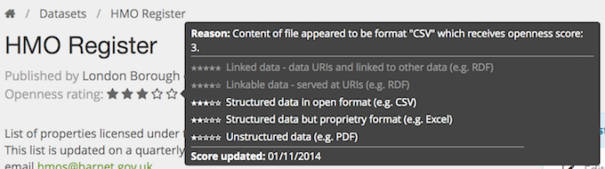

## Introduction

Datasets on data.gov.uk are automatically given an 'Openness rating' to give a simple indication of how well the dataset has been made open. The criteria are based on the [Five Stars of Openness](http://5stardata.info) developed by Tim Berners-Lee.

Often this is a useful driver to improve the data or the metadata. For example releasing data as CSV instead of Excel files gets you to 3 stars instead of 2 (although it is good to provide both if you have them).

Also often this indicates problems with the dataset record - maybe the URL to the data was mistyped, or only goes to a web page about the data.

The 'Openness rating' is automatically calculated for a dataset shortly after it is created, edited or harvested. It checks if the licence is open, if the resource links work ok and if the resource formats are open and linked. The resulting score is between 0 and 5 stars. If you hover the mouse pointer over the stars then an explanation of the scoring is provided.

The overall score is the highest of all the resources, so if you have 3 PDFs (score 1) and a CSV (score 3), then the overall score is 3. There is more about the scheme at: <http://5stardata.info/>

Occasionally the automatic calculation is wrong - it misidentified the format of your file. Do [contact us](http://data.gov.uk/contact) and we can try and improve it.

For overall Openness Score numbers, consult the reports: [Openness (Five Stars) report](http://data.gov.uk/data/report/openness)

### Mechanics of the system

A dataset is given a score by a background program that is triggered when a dataset is changed (e.g. edited, or harvested) and in our regular sweeps of all datasets (currently every weekend).

Usually the check is done within five seconds, but if the site is busy then it can be deferred for a few hours. Hover over the stars to see the date and time the information is valid for.

Each resource has its own score and the dataset is the highest of its resources.

The code is here: <https://github.com/datagovuk/ckanext-qa/tree/2.0>

### Discussion of the Five Stars system

In discussions of the system we hear fears about a few aspects:

* "It is a crude indicator of quality". We think it is a good indicator of the most common problems: open license, open access, structured data and helps inspire the better publishers to aspire to key established best practices: machine-reable schema and common standards. Through our National Information Infrastructure programme, we are working on the other important measures of quality, such as a way to contact publishers, a place to discuss issues etc. We also link to ODI Certificates which provide a comprehensive check-list for data publishing and their opinion of each potential decision.

* "Format isn't everything - CSV files are the bare minimum, but still get a good score (3 out of 5)". To get 3 stars it should have an open licence (including for commercial use), open access (no need to register your name and address, captcha or require a human to find the actual download link), be structured data (does not require scraping or OCR) as well as being an open format like CSV (Shapefile. People forget many of the problems with data releases - a three-star CSV is a reasonably good result - less than half of the datasets make this grade at the time of writing (2015).

* "You can only get 4 or 5 stars if you produce data in RDF, which is pretty niche". RDF is has difficult tools and a small pool of experts, but the potential benefits are clear. We are discussing abstracting the criteria slightly so that data.gov.uk awards 4 or 5 stars for achieving the key benefits of linked data, albeit using more accessible methods. For example W3C and Open Knowledge are exploring how to put CSVs on the web with embedded schema information to enable data to be linked and aggregated in simpler ways than RDF or Linked Data Ontologies.
