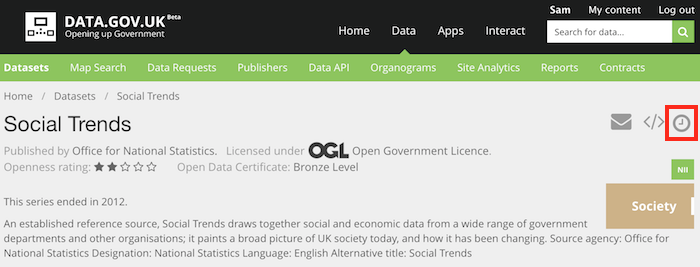
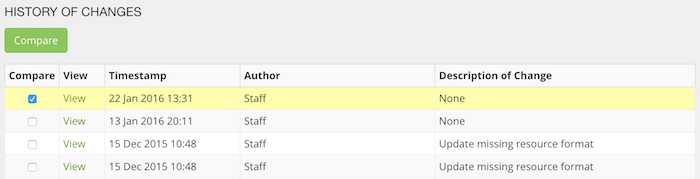
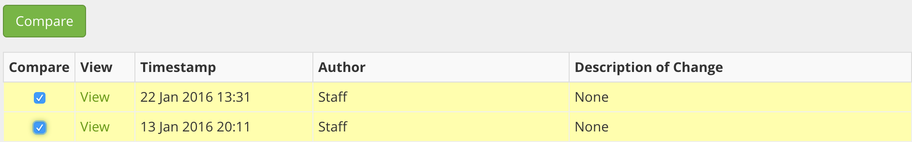
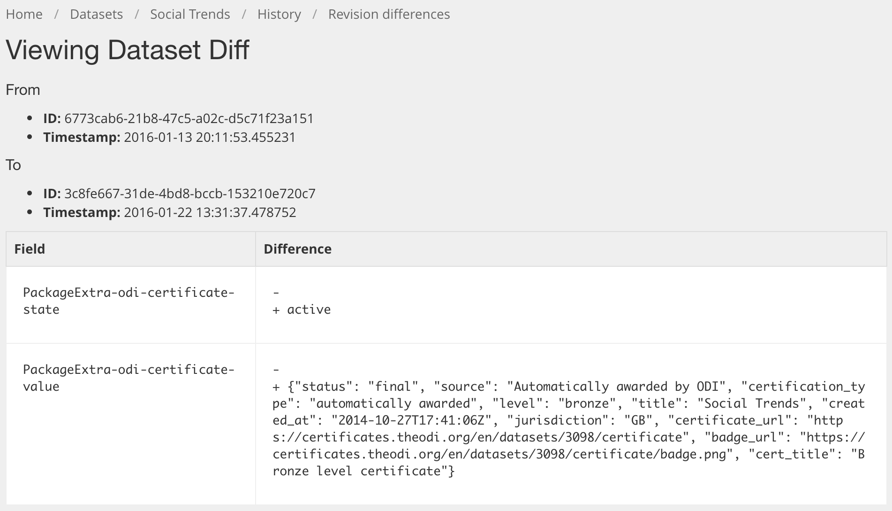

You can see exactly what changes have been made to each dataset since their creation by using the 'History' feature.

Note: You can also do this programmatically by comparing the dataset dump files for different days. See: [data.gov.uk metadata dumps](dgu_metadata_dumps.html)

## Accessing the history

The history is only accessible if you have logged in. This is due to performance reasons. Any user account will do - just register using the link at the top-right, as if you were going to comment on a dataset.

Now on every dataset page, a new icon will appear that links to the history:

## Viewing the history

The history page shows each revision, with the 'current' version at the top. e.g.

### Author

The Author field gives the role of the person who made the change:

| Role | Description |
| ---- | ----------- |
| (name of a publishing organization) | An administor or editor for that organization |
| System Administrator | sysadmin - usually data.gov.uk staff. Either manually or using a script
| Staff | A script - runs automatically and overseen by data.gov.uk staff. e.g. Archiver (broken link checks), QA (5 stars), adding ODI Certificates |
| System Process | A script - runs automatically and overseen by data.gov.uk staff. |
| OKFN team | An old script run by data.gov.uk staff. |

## Viewing datasets as they were in the past

Use the 'View' link on each revision to see how datasets were in past revisions. e.g.

The light yellow box indicates the date of the revision.

## Comparing revisions

You can see exactly what changes occurred between two revisions by selecting two revision check-boxes and then pressing the 'Compare' button.

For example, the checkboxes in the image beloto see the changes made on 22nd January, in comparison to how it was last saved on 13th January:

NB the first revision's checkbox is checked by default but if you don't want to compare with that revision, you must uncheck it before you can check two other revisions. It doesn't let you have more than two revisions checked at once. This is not intuitive, granted.

### Interpreting the comparison

The comparison between two revisions can be difficult to understand because there are lots of detail in the dataset fields. However these are all exposed in the name of providing raw data and being transparent.

The comparison is produced on a field-by-field basis using the 'diff' tool, familiar to programmers. This puts a '-' at the start of a line that has been removed and '+' at the start of a line that has been deleted.

Example:

This dataset has had an ODI Certificate added to it. The details of the certificate are store in an 'extra' field called 'odi-certificate'. The "state" has "+ active" which means it is being created (and conversely it would be "deleted" if it was being deleted). The "value" is all the details of the certificate in JSON format.