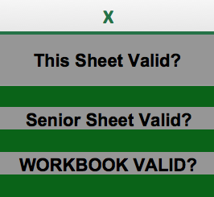
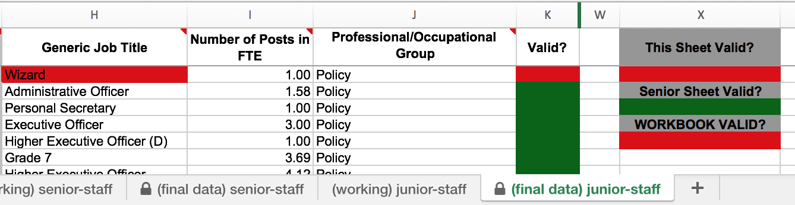
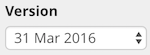

The Prime Minister committed central government and agencies to publish organograms of all staff positions from October 2010. The data includes the hierarchy of senior staff, including names, grades, job titles & salaries and numbers of junior staff that report to them.

Prime Minister's letter: [Letter to government departments on opening up data, May 2010](https://www.gov.uk/government/news/letter-to-government-departments-on-opening-up-data)

## Which bodies are required to do this?

The guidance applies to all bodies within central government as classified by the Office for National Statistics. This includes:

 * departments
 * non-ministerial departments
 * agencies
 * NDPBs
 * trading funds
 * NHS bodies - CCGs, Trusts, Foundation Trusts, SHAs
 * research councils

The ONS classifications can be found the "index" tab: [Public Sector Classification Guide, September 2015 (Excel)](http://www.ons.gov.uk/ons/rel/na-classification/national-accounts-sector-classification/classification-update-and-forward-workplan--september-2015/rft-table-1.xls)

There are a limited number of exceptions to the requirement to publish:

 * intelligence agencies
 * Financial and Non-Financial Public Corporations
 * Parliamentary Bodies

NB Local authorities publish their senior staff data in a different format - see the LGA guidance: http://schemas.opendata.esd.org.uk/OrganisationStructure

## Timing

The data is collected twice a year - snapshots of the roles on 31st March and 30th September, to be published on data.gov.uk by 6th June and 6th December respectively.

## Published data

Organograms are published at <https://data.gov.uk/organogram/>. The web interfaces includes a drop-down to select different organizations, a "Version" slider to select releases for the data at previous time snapshots and a "Sources" button for links to the Linked Data API, which is a web interface offering navigation through and chunks of the data in RDF serializations.

## About the data

### Senior roles

SCS pay band 2 (or equivalent) and above - name of the person, base pay (in £5k pay bands), grade, unit, contact phone/email, job title, role reported to, full time equivalent (FTE), salary cost of reports, professional/occupational group.

SCS pay band 1 (or equivalent) - same as for SCS 2, but without the base pay (which is included in the cost of team reports).

### Junior roles

Below SCS 1 (or equivalent) - unit, senior role reported to, grade, payscale range, generic job title, number of posts in FTE, professional/occupational group.

### Schemas

data.gov.uk provide schemas for the senior and junior CSV files. These describe the fields in greater detail and allows for some automated validation of the files.

  [Organogram schemas by data.gov.uk](https://github.com/datagovuk/schemas/tree/master/organogram)

## Publication process

The Cabinet Office provides departments with an Excel template file, which is completed with the data (according to guidance <http://data.gov.uk/sites/default/files/Organogram%20Visualisation%20Tool%20v1.0_10.pdf> ) and is then submitted into the data.gov.uk Organogram Tool. This system performs validation, ensures salaries are rounded to the nearest 5k and converts the data into RDF format. The RDF is put into the organogram triple store (for SPARQL queries) and served in the Linked Data API.

Publishing organisations should [contact the data.gov.uk team](http://data.gov.uk/contact) to obtain the Excel template and details of the upload into the data.gov.uk Organogram Tool.

In the near future, the CSV data will be provided for download in dataset records in data.gov.uk automatically. So far, several organizations have provided their own copies of the organogram data in CSV format on data.gov.uk and gov.uk manually.

## Publication FAQ

#### Q: Can I publish data for past periods?

Not at the moment. We should be able to though in the new system, so keep hold of the data for the moment.

#### Q: Can a published organogram be replaced or removed?

You can replace an organogram for the current period by reuploading the spreadsheet, ensuring the "Parent Department" and "Organisation" columns remain the same. Occasionally this causes a problem where old data doesn't get deleted, and duplicate roles are seen - see below "Every role is duplicated".

You cannot remove a published organogram without involving the software supplier - if you need this, [contact us](http://data.gov.uk/contact). (In the file upload interface, neither clicking "Published" to change its state, nor "Delete" will remove the organogram from the public view.)

#### Q: Every role is duplicated

This problem can be identified by the number "2" (or more) seen on every role. In addition, the name (or same ID) is listed twice in the information box. For example:

If this is the case, [contact us](http://data.gov.uk/contact) so that we can ask the supplier to sort it out.

#### Q: How do I copy and paste my spreadsheet data onto a new template spreadsheet?

A number of upload problems can be solved by transferring the data from your existing spreadsheet file to a fresh organogram template file. This is quick to do if you use these instructions:

* Copy the entire "reference" sheets across: "(reference) units", "(reference) generic-job-titles", "(reference) junior-grades". If you don't then you'll find the other sheets won't validate.

  In each sheet, press Ctrl-A (Windows) or &#8984;-A (Mac) to select all the cells and then from the Edit menu select 'Copy'. Open the new orgranogram template file, go to the sheet of the same name and from the Edit menu select 'Paste'.

* You don't need to copy the "working" sheets if you don't want to - the system doesn't need them.

* Copying the "final data" sheets needs to be done in parts because you can't paste into the locked cells, which are the header (first) row and the greyed-out columns. To be specific, here are the ranges to copy and paste:

  Sheet                      | Copy cells | Paste in the new workbook at
  ---------------------------|------------|-----------------------------
  (final data) senior-staff  | A2:N2000   | A2
  (final data) senior-staff  | P2:R2000   | P2
  (final data) junior-staff  | A2:E6000   | A2
  (final data) junior-staff  | H2:J6000   | H2

#### Q: How do I fix an spreadsheet that isn't "valid Excel"?

"That doesn't look like a valid Excel spreadsheet."

(not to be confused with messages concerning an "invalid" spreadsheet - see below)

This occurs if the filename does not end in exactly ".xls".

This may be because:
* It has been saved as .xlsx (this newer format is not accepted)
* It has been capitalized
* Macs sometimes leave off the extension completely when saving files

Correct the filename extension using Windows Explorer or Mac Finder before re-uploading.

#### Q: How do I fix an "invalid" spreadsheet?

"The spreadsheet is invalid. Please check your data and try again."

(not to be confused with the error below about an "older spreadsheet template")

If you upload your Excel file and get this error then it means that there is a problem with one or more data rows in the spreadsheet.

To work out exactly where the problem is, open the file in Excel and look on the "(final data)-junior staff" sheet. Scroll to column X and there will be three coloured indicators:

First look at the last indicator 'WORKBOOK VALID?' - green means the file is all ok, or red means there is a problem.

If there is a problem then consult the other two indicators above. Red colours indicate whether the problem is in this sheet ("(final data)-junior staff") or the Senior sheet ("(final data)-senior staff").

For each sheet which has the problem, check the end of each row, where the column is titled "Valid?". Search for the row with the red colour and fix the problem in that row.

More recent versions of the spreadsheet help you further by highlighting red the cell with the problem. A couple of versions of the spreadsheet have an extra column called "Invalid cell (Excel 2011+)" which tells you the column with the problem, although it didn't give accurate information. Also if you have this column in the '(final data) junior-staff' sheet then it will be problematic - if this is the case, please see information below about an "older spreadsheet template" before continuing.

Once all problems are resolved and the 'WORKBOOK VALID?' indicator has gone green and you still get an error when you try to upload it, then [contact us](http://data.gov.uk/contact), supplying the file in question.

#### Q: How do I fix an "older spreadsheet template"?

"The spreadsheet is invalid - You may be using an older version of the spreadsheet template. Please check your data and try again."

(Not to be confused with the error in the previous section of this document that does not mention the "older spreadsheet template")

It means that the spreadsheet structure is not correct.

Follow these steps to find and solve the fault:

* If the '(final data) junior-staff' sheet has "Invalid cell (Excel 2011+)" in cell L1 then this will be causing the problems. This is the case for the spreadsheet template issued on 10/5/16 - "Blank-Organogram-Template_20160510.xls". [Contact us](http://data.gov.uk/contact) to get this column removed, or to get the latest template, into which you can [copy and paste your data in](#q-how-do-i-copy-and-paste-my-spreadsheet-data-onto-a-new-template-spreadsheet).
* If your spreadsheet template was from approximately 2010 then it is too old. [Contact us](http://data.gov.uk/contact) to get the latest template and [copy and paste your data into it](#q-how-do-i-copy-and-paste-my-spreadsheet-data-onto-a-new-template-spreadsheet).
* Check that the key sheets are still called "(final data) senior-staff" and "(final data) junior-staff". Check that on sheet "(final data) junior-staff" there is still the validation block is still in column X in rows 1 to 6. If you can't fix any problems, [contact us](http://data.gov.uk/contact) to get the latest template and [copy and paste your data into it](#q-how-do-i-copy-and-paste-my-spreadsheet-data-onto-a-new-template-spreadsheet).

If you still get the error on upload, you could try getting a fresh template and copy and paste the data across to it.

#### Q: How do I fix error: "Could not find junior sheet"

"Could not find junior sheet. Please check your data and try again."

Follow these steps to find and solve the fault:

* Check that the spreadsheet opens alright in Excel.
* Check that the spreadsheet is not password protected. (It would prompt for the password when you open it in Excel.)
* Check that the key sheets are still called "(final data) senior-staff" and "(final data) junior-staff". Check that on sheet "(final data) junior-staff" there is still the validation block is still in column X in rows 1 to 6. If you can't fix any problems, [contact us](http://data.gov.uk/contact) to get the latest template and [copy and paste your data into it](#q-how-do-i-copy-and-paste-my-spreadsheet-data-onto-a-new-template-spreadsheet).

#### Q: Why hasn't our organogram appeared?

Here is a check-list for when you've uploaded organogram data and don't see it appear at <http://data.gov.uk/organogram/>.

* Check you are looking at the right Department/Public body.

  

  To be sure, select it again using the first box pictured - "Departments". The name of the department/public body should appear in the second box/button.

* Check you are looking at the right "Version" (date) in the viewer.

  

* Check that you changed the state to "Published" (via "Signed off") in the "Preview" screen.

  

* Ensure that you waited until at least the next day since you changed the state to "Published" (it is done during the night).

If you are still not seeing it, then [contact us](http://data.gov.uk/contact).