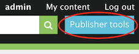
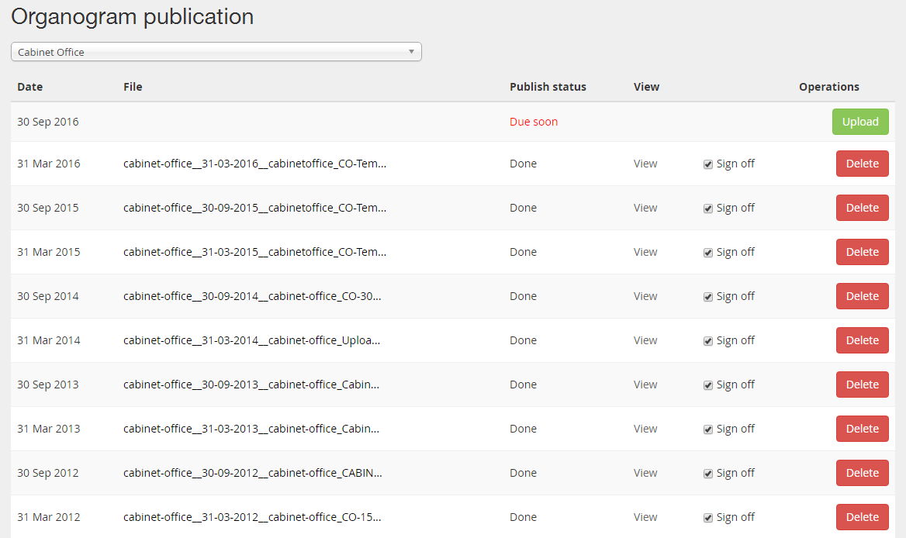
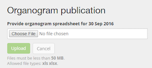
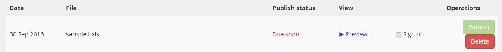
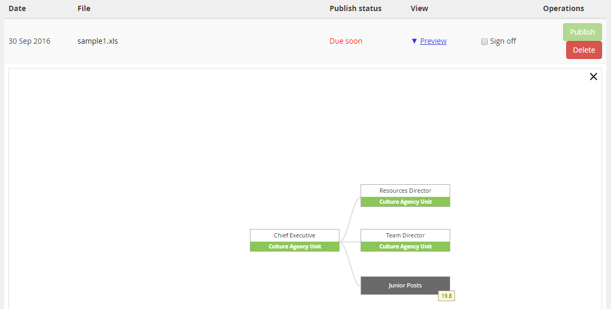
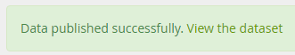
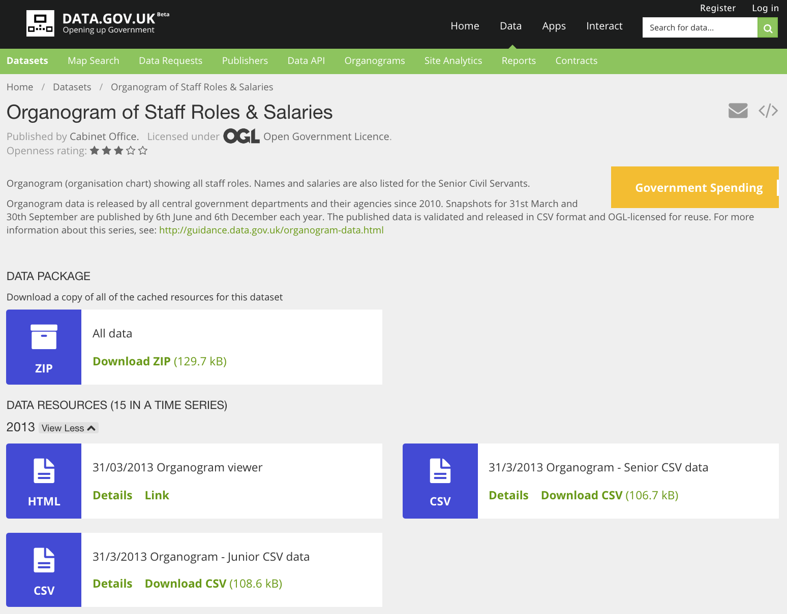
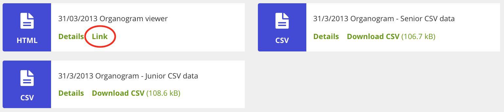
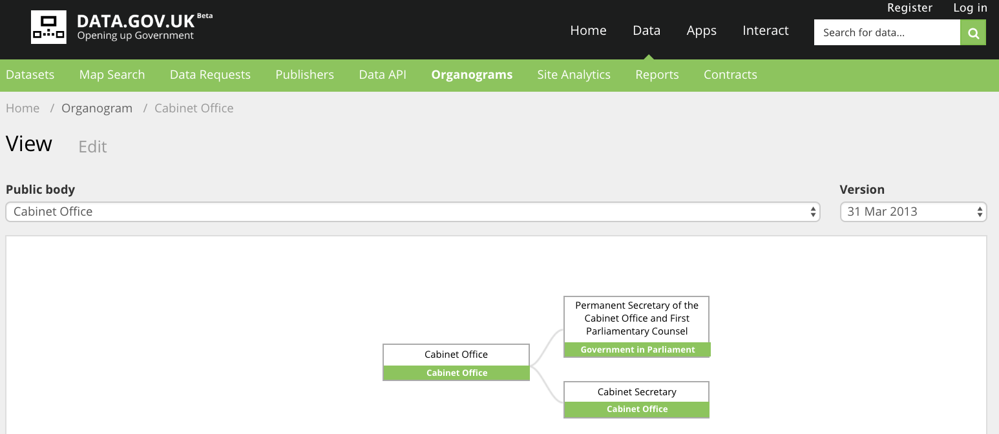

From 3 October 2016, you can upload and publish organogram data (sometimes called 'organogram returns') to data.gov.uk.

Before you start, you must:

* [read our guidance] to find out what data your organisation must publish
* get a copy of the previous organogram spreadsheet or [download a new spreadsheet template]
* fill out the spreadsheet with your organisation data

## Get an editor account on data.gov.uk

You must have a data.gov.uk account with 'editor' or 'admin' permissions to publish organogram data.

1. [Sign in to data.gov.uk](https://data.gov.uk/user) or [create an account](becoming_an_editor_or_admin.html#getting-an-account) if you don't already have one.

2. Look to see if you have the 'Publisher tools' button in the top menu - this indicates you have 'editor' permissions.

   

3. If you can't see the 'Publisher tools' button (or you want to publish organogram for an organisation which is not listed in the 'Publisher tools' button's drop-down menu), [apply to become an 'editor'].

[Contact us](http://data.gov.uk/contact) if you applied to become an editor and haven't heard back for a couple of days.

## View your organograms

1. [Sign in to data.gov.uk](https://data.gov.uk/user).

2. Click the 'Organogram publication' link at the top of your [profile page](https://data.gov.uk/user).

3. Find your organisation in the list of publishers and select it.

4. You'll be able to see every organogram your organisation has published on data.gov.uk so far, including those that will need to be published soon or should've been published already

## Uploading and publishing a new organogram

(These instructions follow on from [View your organograms](#view-your-organograms))

1. Find the organogram you need to publish in the list. They're ordered by date with the most recent at the top of the list.

2. Click the 'Upload' button next to it.

   

3. Find the completed spreadsheet file on your computer and click 'Upload'. If you get an error message, see: [Problems with uploading organograms](#problems-with-uploading-organograms).

   If successful, you'll be sent back to the 'Organogram publication' page when your file is uploaded.

   

4. You can see how the organogram will look when it's published by clicking the 'Preview' link. Only users who have a data.gov.uk account with 'editor' permissions will be able to see this preview.

   

5. You must tick the 'Sign off' box before you can publish the organogram. Only do this when senior approval has been given - for departments that would be from your minister or permanent secretary.

6. You'll now be able to click the 'Publish' button.

   

   The file will be added to your organisation's organogram dataset on data.gov.uk:

   

   Click 'Link' under 'Organogram viewer' to see it.

   
   

## Updating an existing organogram

(These instructions follow on from [View your organograms](#view-your-organograms))

1. Find the organogram you need to update in the list.

2. Click the 'Delete' button next to it. This will remove the file from data.gov.uk.

3. You can now upload the updated file. Find the completed spreadsheet file on your computer and click 'Upload'. You'll see an error message if there's a [problem with the file](#problems-with-uploading-organograms) you're trying to upload.

4. You'll be sent back to the 'Organogram publication' page when your file is uploaded. You can see how the organogram will look when it's published by clicking the 'Preview' link.

5. You must tick the 'Sign off' box before you can publish the organogram. Only do this when your minister or permanent secretary has approved the organogram.

6. You'll now be able to click the 'Publish' button. The file will be added to your organisation's organogram dataset on data.gov.uk.

## Problems with uploading organograms

You won't be able to upload your organogram to data.gov.uk if there are any errors in your completed spreadsheet template.

When you're filling it in, make sure:

- you don't write in fields which should be filled in using options from a drop-down menu, such as 'Parent Department' or 'Grade'
- roles don't report to themselves
- roles don't report to a role that no longer exists ('Eliminated')
- the 'Valid?' column is green for every row

Check your spreadsheet and try to upload it again. Please refer to the guidance, which explains in detail how to complete every column. If you're still having problems, [contact us](http://data.gov.uk/contact).
