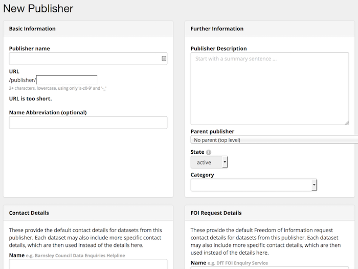
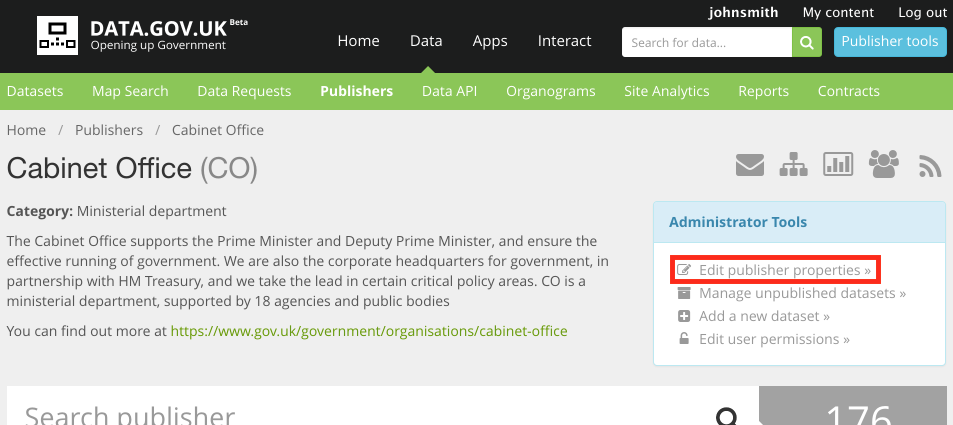
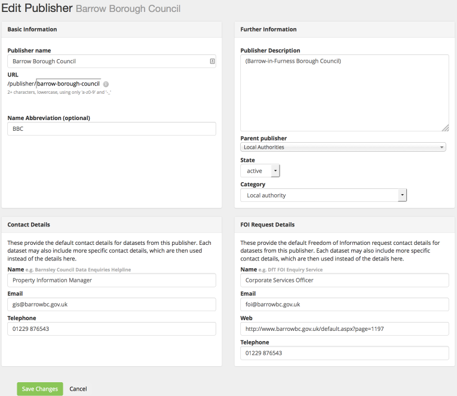
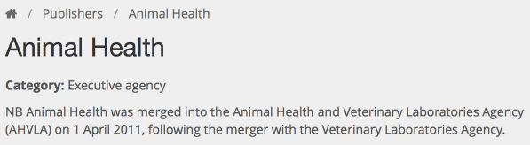

## What is a publisher?

In most cases a 'publisher' on data.gov.uk is a public body. data.gov.uk is the central place for data in the public sector and welcomes data from outside government, such as from the NHS, universities and charities.

data.gov.uk also has publishers created to 'group' others underneath, such as 'Local authorities'. Sometimes there is a need to create a publisher for sub-organization inside a legal body, such as 'Government Digital Services'.

## Publisher tree

The publishers are organized in a tree structure on data.gov.uk, to help understanding. This mostly works well because government is naturally hierarchical, with departments directing their executive agencies and being responsible for their 'arms-length' bodies. However there is many other types of relationships that the tree notionally represents, and it is important not to infer that it means 'control' or 'ownership' - it could be as basic as being in the same subject area.

## Creating a publisher

A sysadmin can create a new 'publisher' on data.gov.uk at: http://data.gov.uk/publisher/new

## Editing a publisher

 A publisher's admins (and parent publishers' admins) and sysadmins can edit the publisher's properties by finding its publisher page and clicking 'Edit':

The publisher form can be edited:

Once changes are complete, click "Save Changes".

## Publisher renames

Although the edit form allows you to change the 'Publisher name', there are some issues to consider:

1. There is a technical difficulty with changing the publisher's URL (because the publisher's datasets need reindexing if that is changed). This can be overcome by getting a developer to run the related paster command, (or for a publisher with only a handful of datasets, hack the form in the browser to allow the field to be editable).

2. Has the publisher actually been closed and a new one created? The new one may not wish to take responsibility for the old datasets and so you might just want to create a new publisher and mark this one as closed.

## Publisher closure, taken-over, merge etc.

If a publisher closes, without an obvious successor, we want to keep the datasets, so the publisher is left, but marked as closed in the description. Ideally we'd marked them as closed visually on the publisher tree, but this has not been implemented yet, so since this is particularly an issue with NHS bodies, we've created the "Previous NHS Institutions" body to move them under.

If a publisher closes and its function is taken over by another body, there is a choice whether to move the datasets under the new body or leave them. It depends on whether the new body wants to take responsibility for them. If choosing to move them, a command-line script is usually written.

For any merge or split, simply mark the publisher as closed and create a new publisher with the new name.

In all cases, it's helpful to add in the description field the details of when it was closed and what bodies took over its functions.

