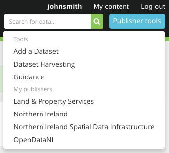

## Managing your account

NOTE: This section assumes you are logged into data.gov.uk and have [become an editor or admin for a publisher](becoming_an_editor_or_admin.html).

### The Publisher tools button - your publishers

The 'Publisher tools' provides a convenient way to navigate to any of your publishers - i.e. ones that you are an editor or admin for.

You can also add a dataset from this menu or go to the harvesting page.

### Publisher information icons

On a publisher page, there is a bar of icons on the right hand side. They are explained in this diagram:

### Publisher Administrator Tools

On a publisher page, an Editor or Admin sees the blue 'Administrator Tools' button, giving you access to the management operations.

* [Edit publisher properties](publisher_editing.html) - only available to Admins
* [Manage unpublished datasets](unpublished.html) - only available to Admins
* [Add a new dataset](dataset_form.html)
* [Edit user permissions](assigning_editors_and_admins.html#edit-user-permissions-page) - only available to Admins

