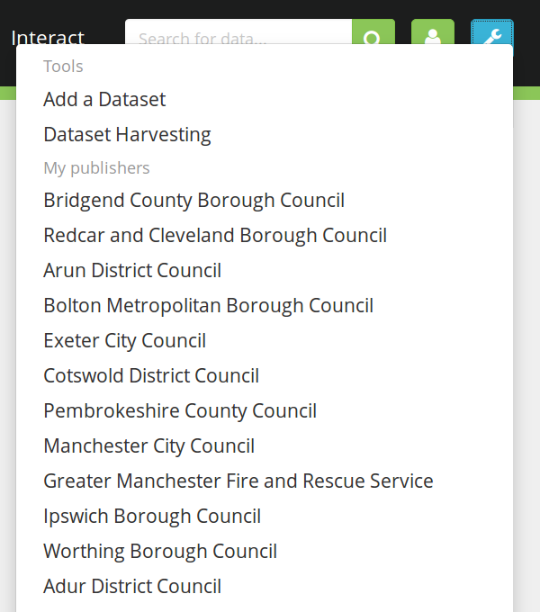
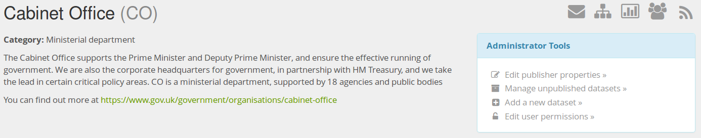
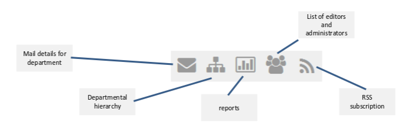

## Managing your account

```
This section assumes you are logged into data.gov.uk
```

### The lock icon - your publishers



1. The ‘lock’ icon allows you to see and go to any of the publishers you have rights for
2. The ‘user’ icon allows you to see your profile or log out
3. You can add a dataset directly from the menu or go to the harvesting page

### The information icon bar and the administrator toolbox



1. This row of icons gives you basic tools, detailed below
2. The administrators box gives you access to the key operations you need to perform. ‘edit user permissions’ is only available to administrator accounts


