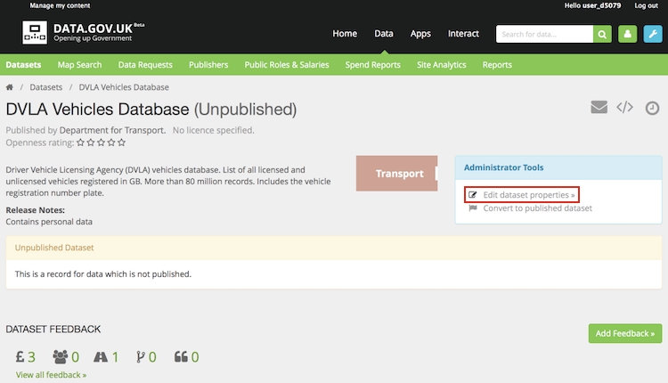
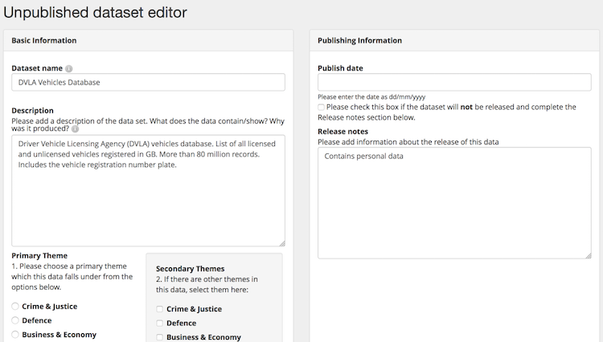
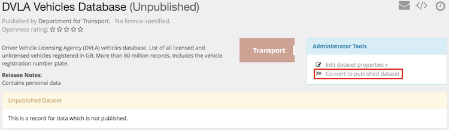
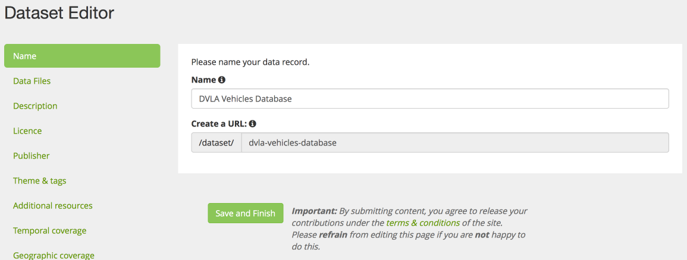

## Introduction

Whilst data.gov.uk is best know for its catalogue of 'published' datasets, since September 2013 it has also included 'unpublished' datasets as well. These are datasets which exist but have not been made available publicly. In this way, data.gov.uk becomes an 'inventory' of data.

The reason for providing an inventory is to pursue a policy of 'open by default' and enable an open conversation about making specific datasets open or not. data.gov.uk has always has always provided a mechanism for the public to request data to be made open, and that is facilitated by knowing what data exists.

Clearly some many of the unpublished datasets are difficult or impossible to make public. For instance, much data about government employees needs to remain private (although details of senior civil servants, and counts of civil servants [are available](http://data.gov.uk/organogram/cabinet-office)). However there are plenty of opportunities to open up data, and cataloguing them and providing a forum for both the public and the publisher reduces friction in this happening.

## Managing unpublished datasets

Please ensure that you are logged in and have been made an 'admin' for your publisher. If you do not see the blue spanner icon check out [this guide](becoming_an_editor_or_admin.html). If you have the blue spanner icon but not the 'Manage unpublished datasets' link then you are an editor not an admin. In this case, [contact data.gov.uk](http://data.gov.uk/contact) to request upgrade.

### Adding

You can add to the catalogue your unpublished datasets from the management page for your publisher's unpublished datasets. To access this, first find your publisher page. When you log-in there is a link to your publisher page(s), or alternatively click on 'Data', 'Publishers', search for your publisher and then click on it. For example the 'Highways Agency' publisher page is at <http://data.gov.uk/publisher/highways-agency>
 
The management page is linked in the blue box:
!(Link to unpublished)[images/unpublished_link.png]

The management page is relatively self-explanatory:
!(Unpublished datasets management page)[images/unpublished_manage.png]

The suggested steps for reviewing and adding datasets are:

1. Download the read-only dataset list to review your existing open data
2. Download the inventory template 
3. Upload the completed inventory template

### Editing

Once an unpublished dataset is listed on data.gov.uk, it can be changed by the publisher's editor or admin, in the same way as any dataset published using the form: on the dataset page click 'Edit':

and the edit form opens:

### Converting to published

When a dataset is published then the record on data.gov.uk needs to reflect that.

In many cases you will simply want to convert the record into a published one, edited using the web form - this can be done on the dataset page by clicking 

This will open the edit form for you to add the detail about the dataset - in particular you should complete the Licence and Data Files sections. When you save it (without any validation errors), it will at this point be in the 'published' state. However if you close the browser tab before saving it will remain 'unpublished'.

NB There are other circumstances when a straight conversion to a published record is not suitable. For example you might want to harvest the newly published record, rather than create it in a form, or there is not a 1:1 mapping of unpublished datasets to published datasets. In this case, we suggest you simply create the published datasets and then [contact data.gov.uk](http://data.gov.uk/contact) to provide links to the unpublished and published datasets, pointing out the duplication and request the unpublished ones are deleted.
